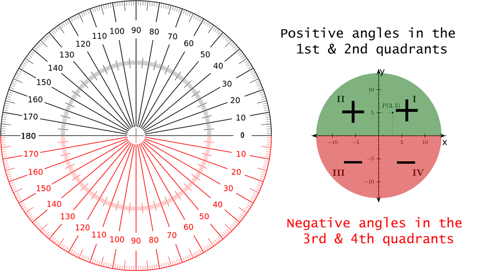
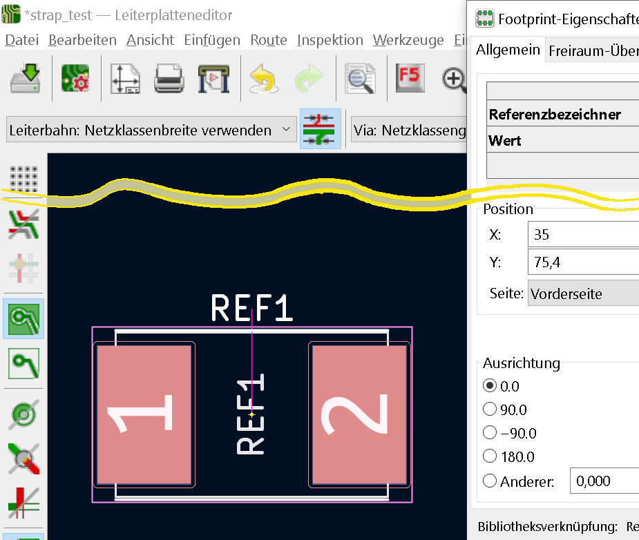
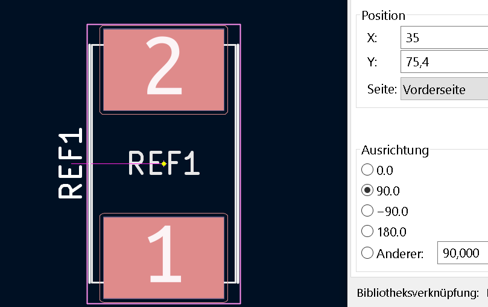
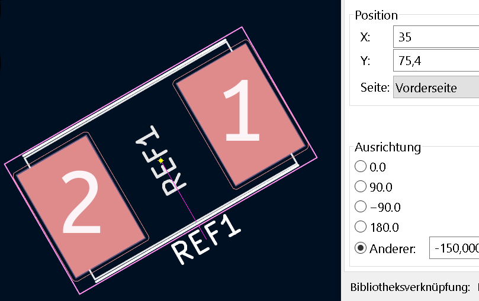
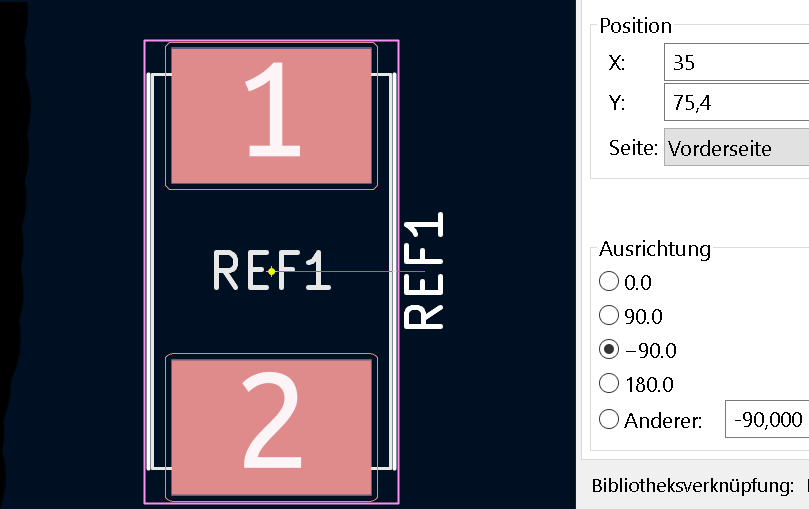

<h1>KiCat footprint alignment</h1>
<article>
<dl>
  <dt>KiCad, Angular specifications when aligning footprints.</dt>
  <dd>If you want to align a footprint for the first time, which should
not be aligned in the obligatory four cardinal points, you are faced
with the problem, how is this solved in KiCad?</dd>
  <dd>In everyday life and in the early years of mathematics education,
  the degree to which a full angle is 360°, a straight angle is 180°
  and a right angle is 90°.
  </dd> <!-- other terms and definitions -->
</dl>
<dl style="text-align: center;">
  <dt>
    
  </dt>
  <dt style="text-align: left;">Angle as a difference in direction</dt>
<dd style="text-align: left;">We are familiar with angles from planar geometry, 
in particular from the calculation of triangles.
 
An angle is the difference in direction between two rays (the sides of the angle)
that emanate from a common starting point (the vertex of the angle).
</dd>
<dt style="text-align: left;">Oriented angle as rotation angle</dt>
<dd style="text-align: left;">
If one also wants to describe rotations with angles, the direction of
rotation (to the left or to the right) must also be added. The angles
are given an orientation, or to put it less elegantly: a sign.
 
To do this, one of the two legs is marked as “first” and it is determined
that a counter-clockwise rotation of this leg (a left-hand rotation)
corresponds to the positive direction of rotation. Correspondingly, a
clockwise rotation of the leg (a right-hand rotation) is assigned the
negative sense of rotation.
This convention obviously dates back to a time when clocks still had
faces and phones still had dials; it can be considered accepted.
  </dd>
  <dd style="text-align: left;"> Angles are usually measured counter-clockwise. If you have a
  coordinate system, you would have an angle of 0° if the vertex of the
  angle lies on the point (0|0) and both legs on the right, positive
  part of the x-axis.
  </dd>
  <dd style="text-align: left;">If a leg moves up in the direction of the y-axis, the values of
  the angle increase. However, if a leg moves downwards, i.e. clockwise,
  the angles measured would then be referred to as negative.
  </dd>
</dl>
<dl style="text-align: center;"><dt>
  </dt>
<dd>If you look at the next pictures you will notice that the center point (yellow) 
is always in the middle of the footprint. Also note the X and Y values in the pictures.</dd>
</dl>
<dl style="text-align: center;"><dt>
  </dt>
<dd>In the first example, the second pad moves exactly 30° up. To do this, highlight 
the footprint and press the "<b>E</b>" key for self-switching. Left Below is the Alignment section. 
	There you enter 30 in the Other field. Click on "<b>OK</b>" to save the rotation..</dd>
</dl>
<dl style="text-align: center;"><dt>
  </dt>
<dd>A 90° rotation can also be achieved by pressing the "<b>R</b>" key.</dd>
</dl>
<dl style="text-align: center;"><dt>
  </dt>
<dd>You can achieve a rotation of 150° by entering 150 for 30° as above.</dd>
</dl>
<dl style="text-align: center;"><dt>
  </dt>
<dd>A 180° rotation can be achieved by repeatedly pressing the "R" key.</dd>
</dl>
<dl style="text-align: center;"><dt>
  </dt>
<dd>You can achieve -150° rotation by typing -150 as explained above.</dd>
</dl>
<dl style="text-align: center;"><dt>
  </dt>
<dd>A -90° rotation can be achieved by pressing the "R" key three times.</dd>
</dl>
<dl style="text-align: center;"><dt>
  </dt>
<dd></dd>
</dl>
</article>
